# Temel Windows MS-DOS Komutları Nedir?
---
MS-DOS komutları, Windows'un komut satırı arayüzünde (CMD) kullanılan temel komutlardır. Bu komutlar, dosya ve dizin yönetimi gibi işlemleri gerçekleştirmek için kullanılır. 

## Komut istemi nasıl çalışır ?
 **1**
 klavyenizdeki
     
    Win +R

tuşlarına aynı anda basınız.

**2**
Açılan "**Çalıştır**" penceresindeki kutuya 

       cmd
        
yazarak  " **Tamam** " butonuna basınız.

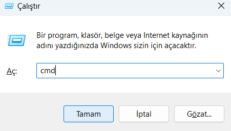

## Komut İstemi Penceresi Neye Benzer

    Başlat - Programlar - Donatılar - Konut İstemi

Şimdi  ms-dos komut istemi penceremizi açtık artık kodlarımızı birer birer öğrenmeye ve uygulamaya başlayalım :

**1.dir** :
---
     
**dir(directory)** komutu, bir dizindeki dosya ve klasörlerin listesini, son değiştirme zamanı ve dosya boyutlarıyla birlikte görüntüler.

- dir /a :

**/a**  parametresi ile dir komutu, gizli ve sistem dosya ve dizinleri dahil olmak üzere tümünü (a)ll listeler.

- dir/ah :

**/ah** parametresi ile dir komutu sadece gizli /(h)idden dosya ve klasörleri listeler.

**2.cd** :
---

**cd(change directory)** komutu, üzerinde bulunan dizini değiştirmek için kullanılır.

- **cd** komutundan sonra direk bir dizin yolu (directory path) da girilebilir.
  

**3.md** :
---

**md komutu(make directory)** bulunulan dizin içerisinde " **Yeni Klasör** " adında, bir boş dizin oluşturur. Sizde bu komutu uuygulayıp ardından " **dir** " komutu ile " **Yeni klasör** " adında bir klasörün oluştuğunu gözlemleyebiliriz.

- md komutu ile tek cümle ile iç içe dizinler oluşturmanız mümkündür.

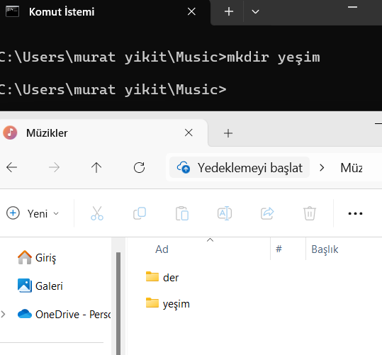

**4.ver** :
---

**ver komutu** işletim sisteminin sürüm bilgilerini görüntülemek için kullanılır. 
 
 
 ver **komutunun Özellikleri** :

 **1.işlevi** :

 * kullanıldığı zaman işletim sisteminin sürüm numarasını gösterilir.
 * Daha detaylı bilgi vermez; sadece sürüm numarası gösterir.
  
  **kullanımı** :

  * Komut istemine (command prompt) şeklinde yazılır.

 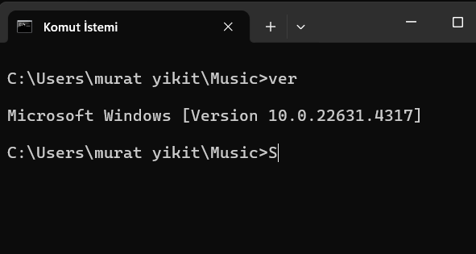

 **5.del** :
  ---

 del(delete) komutu dosyaları silmek için kullanılır.

 **del** a.txt :

 -bu komut bulunulan dizindeki "**a.txt**" metin dosyasını siler.
 

 

 

 **6.ren** :
 ---

 Dosya ve klasörlerin isimlerini değiştirmemize yarar. Windows arayüzündeki karşılığı " **sağ Tuş Menü> Yeniden Adlandır** " butonudur. 

 * dosya veya kalsörün uzantısını da değiştirir.
  
  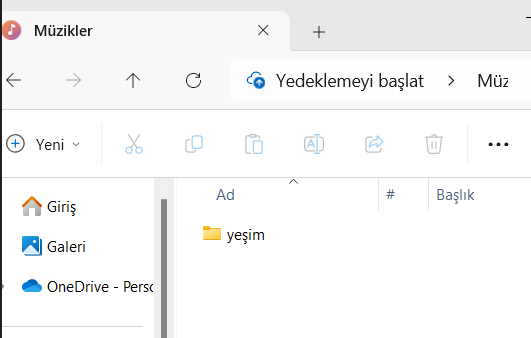
  
  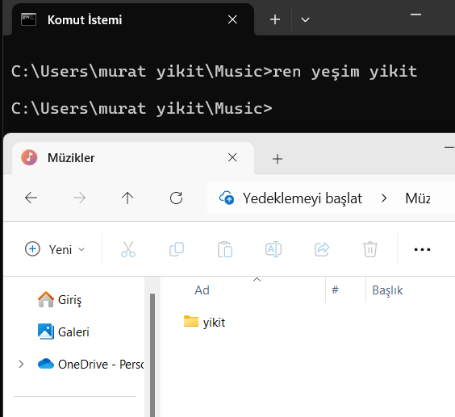

 **7.move**  :
 ---

 Dosya ve klasörleri, bulunduğu dizinden başka bir dizine taşımamıza yarar.(kes + yapıştır olarak da düşünülebilir.
 )

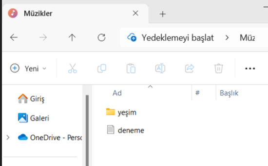

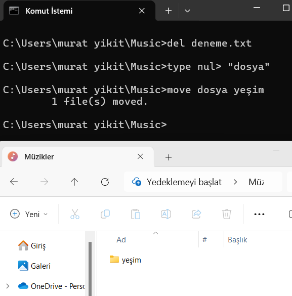

 **8. ping** :
 ---

**ping** komutu, ağ bağlantılarını test etmek ve bir hedefin  (bir sunucu veya cihazın) erişilebilirliğini kontrol etmek için kullanılan bir ağ teşhis aracıdır. Hem Windows hem de Linux gibi sistemlerde bulunur.

  **İşlevi** :

  a. Hedef cihazın eriişilebilirliğini kontrol eder.

  b. Ağ gecikme süresini (ms) ölçer.

  c. Ağ sorunlarını teşhis eder.

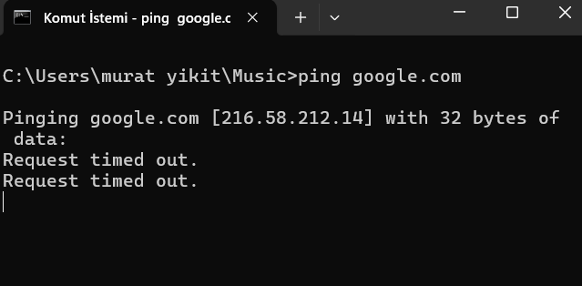

**9.tree**  : 
---

Klasör içindeki dizinleri **soy ağacı** şeklinde görüntüler.

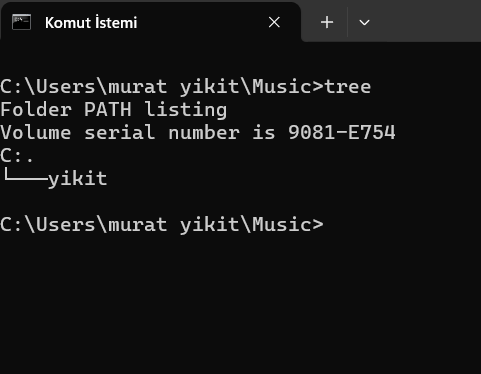

**10.vol** :
---

Bir sürücünün etiket adını (volume label) ve seri numarasını görüntüler.
  **Kullanımı** : 

  Komut istemcisine (CMD) aşağıdaki gibi çalışır :

  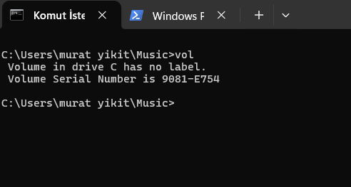

**11.date** :
---

Bilgisayarın geçerli sistem tarihi görüntülemek ve güncellemek için kullanılır.

İPUCU:  Eğer **date** komutunu kullandıktan sonra tarihi değiştirmekten vazgeçerseniz hiçbir şey yazmadan sadece **enter** tuşuna basmanız yeterlidir.

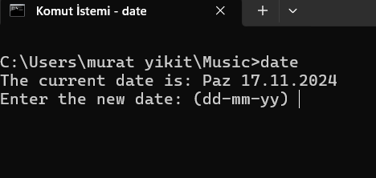

**12.net**  :
---

Ağ bağlantılarını ve ilişkili servisleri yönetmek için kullanılan kapsamlı bir komuttur.

* 1.net user : Kullanıcı hesaplarını listelemek veya silmek için kullanılır.
  

* 2.net user : Klasör paylaşımını yönetir.

* 3.net view : Ağdaki cihazları ve paylaşılan kaynakları gösterir.

* 4.net use : Ağ sürücülerini eşleştirir veya bağlantıları kaldırır.

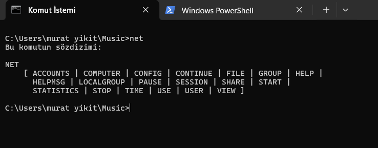

**13.hostname** :
---

Bilgisayarın adını öğrenmek için kullanılır.

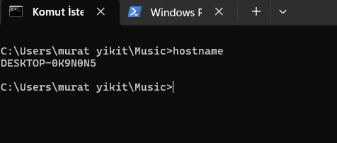

 **14.getmac**  :
---
 

 AMACI :

 Windows işletim sisteminde bilgisayarın ağ bağdaştırılarına ait  **MAC (Media Access Control)**  adreslerini görüntülemek için kullanılır. 

 Bu komut bir bilgisayarın ağ arayüzlerine dair hızlı bir şekilde bilgi edinmek için oldukça kullanışlıdır.

 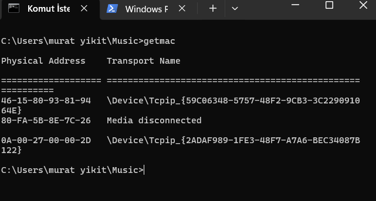

 **15.assic**  :
 ---

 **assic** komutu : 

 1.Tüm dosya ilişkilendirmelerini listeler.

2.Belirli bir dosya uzantısının ilişkilendirmesini görmemizi sağlar.

3.Dosya uzantısını programla ilişkilendirmesini değiştirmemizi sağlar.

4.Bir ilişkilendirmeyi kaldırır.

 

**16.ipconfig** : 
---

**ipconfig**  komutu bilgisayarın sahip olduğu ağ bağdaştırıcılarının geçerli ağ yapılandırmasını listeler.

Genellikle daha ayrıntılı görüntülemek için **/all** parametresi ile kullanılır.

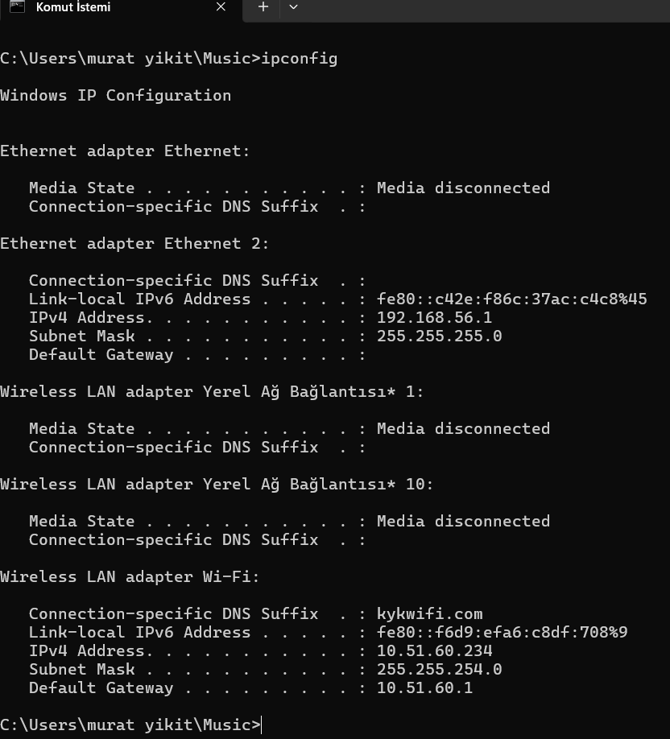
 

**17.cls** :
---
Windows komut istemcisinde (command prompt) ekranı temizler. Kullanıcıya mevcut komut geçmişini gizleyerek yeni bir başlangıç sağlar ve komut satırında daha düzenli bir görünüm sağlar.

**18.netsh wlan show profile** :
---

  cihazda kaydedilmiş tüm kablosuz ağ profillerini (wi-fi bağlantıları) listelemek için kullanılır

  **Komutun İşlevi**

  1. Kaydedilmiş Wi-Fİ Ağlarını görüntüler.
  2. Wi-Fi profilleri hakkında detaylı bilgi almamızı sağlar.
  3. Kaydedilmiş Wi-Fi şifresini görmemizi sağlar.

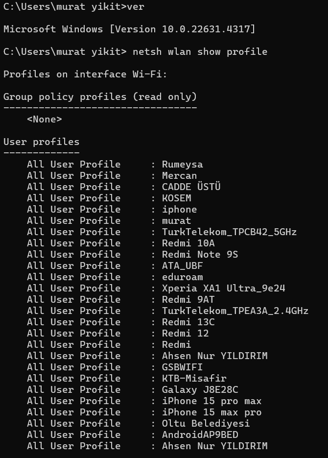  

**19.shutdown**
---

**Bilgisayarı kapatmak** (shutdown) veya **yeniden başlatmak** (restart) için kullanılır.

* Bilgisayarı kapatmak için **/s** parametresi ile kullanılır.

* Bilgisayarı yeniden başlatmak için ise **/r** parametresi ile kullanılır.

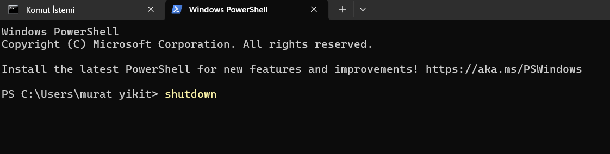

**20.help**
---

* Komut Yardımı Sağlar : help  [komut_adı] şeklinde kullanıldığında belirli bir komut hakkında ayrıntılı bilg, verir. 

#ipconfig komutunu kullanarak **ipconfig** komutunun ne işe yaradığını ve hangi parametrelerin kullanılabileceğini öğrenilir. 

* Komut Listesi Görüntüler : 
Sadece help komutu yazdığınızda mevcut tüm komutların kısa açıklamalarıyla bir listesini gösterir. Bu komut işlemcisinde hangi komutların kullanılabileceğini görmek için faydalıdır.

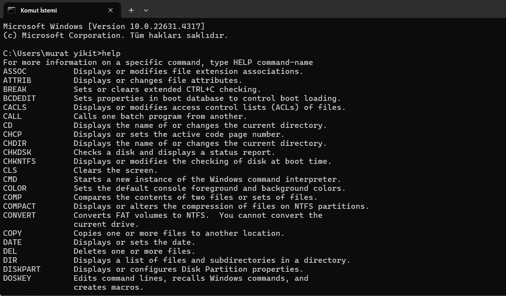

